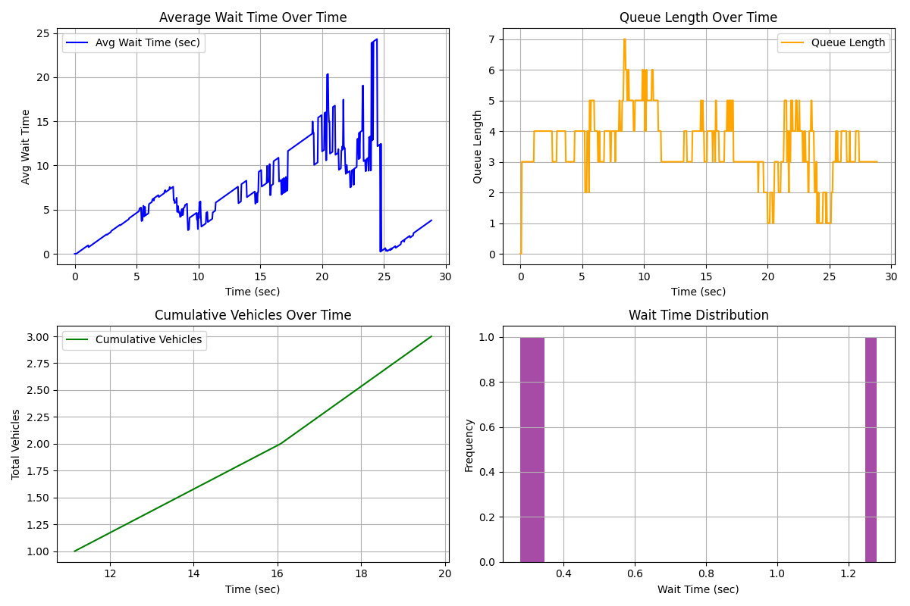

🚦 Real-Time Queue Analysis System (Computer Vision)

A high-performance computer vision system that analyzes vehicle queues from CCTV footage to estimate waiting time, congestion levels, and throughput, and generates actionable operational insights.

Built to simulate real-world traffic optimization problems using deep learning + tracking + analytics.

🎯 Key Impact

📉 Reduced manual monitoring by automating queue length & wait time estimation

⚡ Achieved real-time performance using GPU acceleration and batch processing

📊 Delivered data-driven insights for traffic optimization (not just detection)

🧠 Designed a decision-support system with intelligent suggestions

🧠 Core Skills Demonstrated

Computer Vision: Object detection (YOLOv8), tracking (BYTETrack)

System Design: Real-time pipeline with batching + multithreading

Data Analysis: Time-series analytics & visualization

Optimization: GPU utilization (CUDA, mixed precision)

Applied AI: Translating model outputs into actionable insights

⚙️ Tech Stack

Python, OpenCV, YOLOv8 (Ultralytics)

Supervision (tracking + annotation)

PyTorch (CUDA acceleration)

NumPy, Matplotlib

🚀 System Architecture

Video Input → YOLOv8 Detection → BYTETrack Tracking → Zone Filtering
           → Wait Time Estimation → Analytics Engine → Visualization + Insights

🔍 Key Features

1. Real-Time Vehicle Detection & Tracking

Detects cars, bikes, buses, trucks

Assigns unique IDs using BYTETrack

2. Queue Intelligence Engine

Polygon-based queue zone detection

Tracks:

Queue length

Vehicle entry/exit

Individual wait times

3. Performance Optimization

⚡ Batch inference on GPU

🧵 ThreadPoolExecutor for parallel processing

🔄 Efficient memory handling (CUDA optimization)

4. Analytics Dashboard

Generates insights such as:

Average wait time over time
Queue length trends
Vehicle throughput
Wait time distribution

5. Decision Support System

Provides real-time recommendations:

High congestion → Add lanes / improve signal timing

Medium congestion → Optimize operations

Low congestion → System running efficiently

📊 Results & Visual Outputs

🎥 Processed Video Output

Annotated video (Q result.mp4) showing:

Bounding boxes + tracking IDs

Queue zone visualization

Live overlay:

Queue length

Average wait time

Total vehicles processed

System recommendation

[Watch Demo](assets/Q_Result.mp4)

📈 Analytics Dashboard

Generated automatically after processing:

Average Wait Time vs Time

Queue Length vs Time

Cumulative Vehicles Processed

Wait Time Distribution

🧪 Example Use Cases
Petrol pump queue optimization
Toll booth traffic analysis
Smart city traffic monitoring
Drive-through efficiency analysis

⚙️ How to Run
git clone https://github.com/Zaeem-Irtiza/queue-analysis-system.git
cd queue-analysis-system
pip install ultralytics opencv-python supervision matplotlib numpy torch tqdm
python "Real Time Petrol Pump Queue Analysis System.py"
🧩 Engineering Highlights
Designed a custom queue tracking system using entry/exit timestamps
Implemented asynchronous callback handling for vehicle lifecycle events
Built a scalable processing pipeline with batching + parallel execution
Converted raw detections into meaningful business metrics
🔮 Future Work
Real-time dashboard (Streamlit)
Integration with queuing theory models
Multi-camera system
Deployment on edge devices (Jetson Nano)

👤 Author
Zaeem Irtiza Ahmad
Focused on Robotics | Computer Vision | AI Systems

⭐ Why This Project Stands Out

Unlike basic detection projects, this system:

Goes beyond “detecting objects” → understands system behavior
Bridges AI + real-world decision making
Demonstrates end-to-end engineering (model → system → insights)
